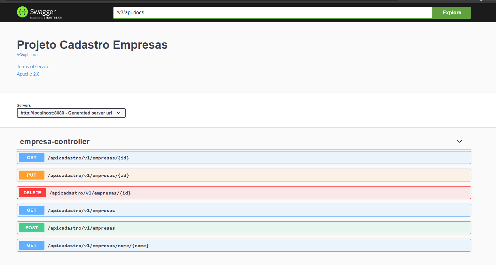
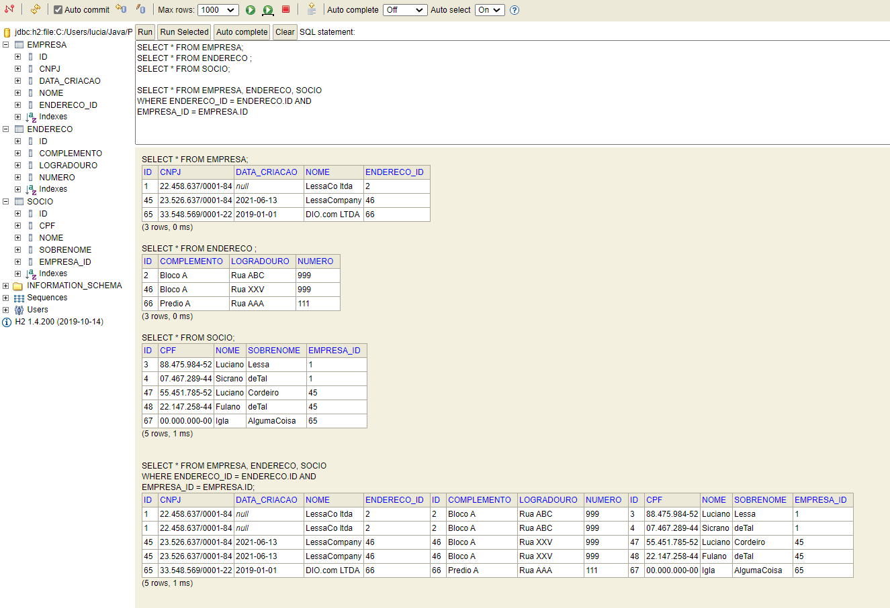

# Projeto Cadastro de Empresa - API REST

### Objetivo

- No Bootcamp Code-Anywhere foi desenvolvido um sistema API REST para cadastro de pessoas. 
  - O mesmo projeto pode ser encontrado no link: [Lessalc/personapi: Project from DIO for User registration (github.com)](https://github.com/Lessalc/personapi)
- Visando usar o mesmo conceito visto no curso, mas criando alterações e adicionando novas funcionalidades, optei por criar um sistema API REST para cadastro de empresas. 

- Assim, foi criado um **API REST** para _cadastrar_, _alterar_, _recuperar_ e _deletar_ uma empresa, com todas as informações que a mesma possui.

- Iremos criar nosso API usando o banco de dados **H2** 

- A empresa, conta com as seguintes informações:
  - Nome
  - CNPJ
  - Data Criação
  - Endereço 
    - Logradouro, numero e complemento
    - Para alterar o exemplo do projeto vamos usar uma relação `@OneToOne`
      - Esse tipo de relação nos diz que para cada Empresa há somente um Endereço
      - A ideia de separar o endereço é seguir o padrão de normalização para bancos relacionais.
  - Socios
    - Nome, sobrenome e CPF
    - Nesse caso usaremos a relação `@OneToMany`, na qual cada empresa pode ter 1 ou mais sócios.
  
- Além disso foi acrescentada uma `@bean` com objetivo de gerar uma interface de mapeamento das requisições existente. Para isso usamos **Swagger**.

- O resultado final consiste na seguinte interface:

  

- Já no banco de dados teremos como resultado:

  

  - Aqui Criamos um exemplo, no entanto, como pode ser visto o exemplo foi feito antes de adicionar as anotações para CPF e CNPJ.

### Sobre as Camadas

#### Entity

- Aqui iniciamos criando as entidades que existem no nosso banco de dados, ela representa exatamente nosso banco
- Possuimos uma entidade para cada tabela do nosso banco de dados. 
- O ponto mais importante das entidades é criar a relação entre as tabelas. Para isso usamos anotações de relacionamento.
  - A tabela que será responsável, a "dona" das demais, é a **Empresa**.
    - A tabela **Empresa** possui em seus atributos um endereço, sendo apenas um endereço para cada empresa. Para isso criamos a anotação `@OneToOne`. Além disso, usamos a anotação `@JoinColumns` com os atributos `name=` e `referencedColumnName=`, onde o primeiro nos diz o nome que será acrescentado na tabela **Empresa** e que será a **ForeingKey**, indicando uma coluna de referencia da tabela **Endereco**
    - A tabela **Empresa**, possui, também, uma lista de sócios. Essa é uma relação `@OneToMany`, onde cada Empresa possui um ou mais sócios. Usamos aqui tbm um `@JoinColumn`, mas nesse caso, como para uma empresa há vários sócios, a **ForeingKey** está localizada na tabela **Socio**.

#### Controller

- Camada responsável pelo mapeamento dos métodos HTTP. Essa é a camada que estará visível em nossa interface, para apartir do **path** definido enviarmos as requisições e informações para a camada Service.
- Nessa camada não vamos interagir com as entidades, a fim de seguir o padrão RESTful usaremos uma camada DTO, onde podemos definir regras para nosso atributo e controlar o que realmente vai para nosso banco de Dados. No nosso exemplo vamos definir anotações de CPF e CNPJ. De forma a respeitarem o padrão correto, sem que seja necessário criar uma classe para checar se as informações passadas estão corretas. 

#### Service

- Camada responsável pelas regras de negócio. As requisições provenientes da camada controller é recebida e executada, seguindo as regras definidas.
-  Nessa camada iremos interagir com o Banco de Dados, a partir da camada Repository.

#### Repository

- Camada na qual fazemos a interação com nosso banco de dados, salvando, alternado, recuperando e excluindo dados diretamente do banco.

### Como inserir dados

- A inserção de dados é feita a partir de um JSON. Um exemplo pode ser visto abaixo:

``` {
{
"nome": "LessaCompany",
  "cnpj": "22.458.637/0001-84",
  "criacao": "13/06/2021",
  "endereco": {
    "logradouro": "Rua XXV",
    "numero": "999",
    "complemento": "Bloco A"
  },
  "socios": [
    {
      "nome": "Luciano",
      "sobrenome": "Cordeiro",
      "cpf": "88.475.984-52"
    }, {
      "nome": "Fulano",
      "sobrenome": "deTal",
      "cpf": "07.467.289-44"
    }
  ]
}
```